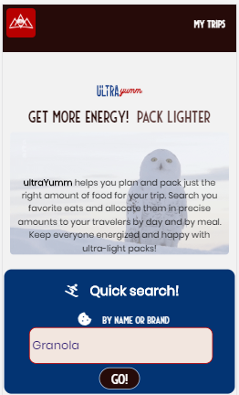

# ultraYumm©
ultraYumm helps users select high energy and low weight foods for long distance hiking and packing.

## Motivation
Current food and menu planning apps are focused on weight loss and/or calorie minimization. None are specifically designed to assist with long term planning for users seeking maximum energy and ultra-light packing. When I last planned a hiking menu for my family of 4, I struggled with clunky spreadsheets and having to scrape the web for key information. I hope this app is useful to hikers and traveler like me who need to keep everyone energized and happy with as little weight carried as possible!

## Current Features
- Search for any food or brand name
- Results are ranked by highest calorie per 100gram ratio
- Results include: food name, brand name or "common" food designation, serving quantity, serving unit, calories per serving unit, weight per serving unit and calories per 100grams
- Print results
- Create one or multiple trips with name, start and end date, url and travelers
- Push search items to selected trip, with option to assign to a specific date, traveler or meal type
- All pushed item fields can be edited and customized, most importantly serving quantities
- Trips results table shows all items assigned to a specific trip with the total sum of calories and weight for all items displayed 
- Items can be deleted from trip results table
- Custom items can be created and assigned to a trip

## Screenshots

## Future Development
This a work in progress! Planned user functionality includes the following:
- Secure user login and account 
- Share app content on social media platforms
- Trip and search results table sort and filter functionality
- Scan UPC codes to create new items
- Link to purchase selected items online
- See other nutritional information such as nutrients, minerals, protein and fat values
- Determine user daily caloric needs based on biometric, effort and distance travelled information
- Enhanced display of summary trip information, including daily calorie and weight
- Delete, save as or rename trip functionality

## Built With
Front-End: JavaScript, React, Enzyme, jQuery, HTML5, CSS3
Back-end: SQL, Node.js, Mocha & Chai, REST APIs 3

## Author
Stephanie LeBlond email: smaleblond@gmail.com cell: 310-989-7801

## Contributors Wanted!
I'm building and enhancing this app as a volunteer project in my spare time for anyone to enjoy.
Pull requests are welcome. I have tons more to learn about web and app development so please aso share your feedback and suggestions.

## Demo
https://build.ultrayumm.vercel.app